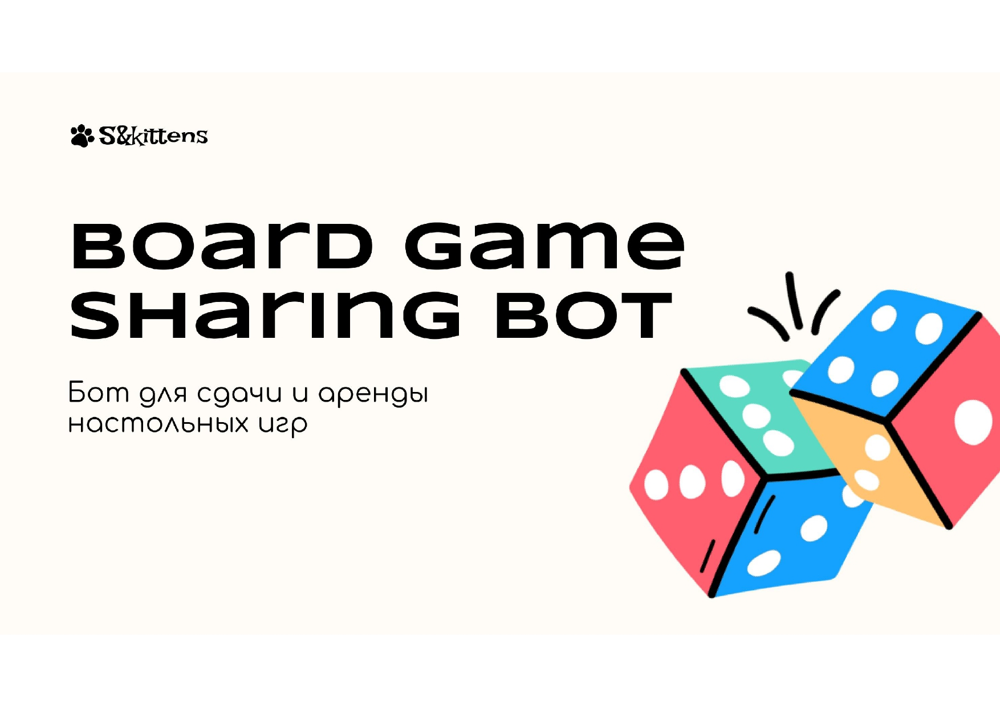
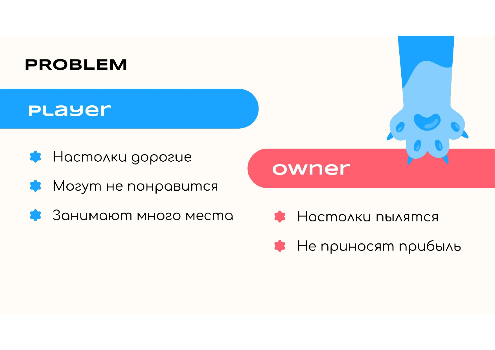
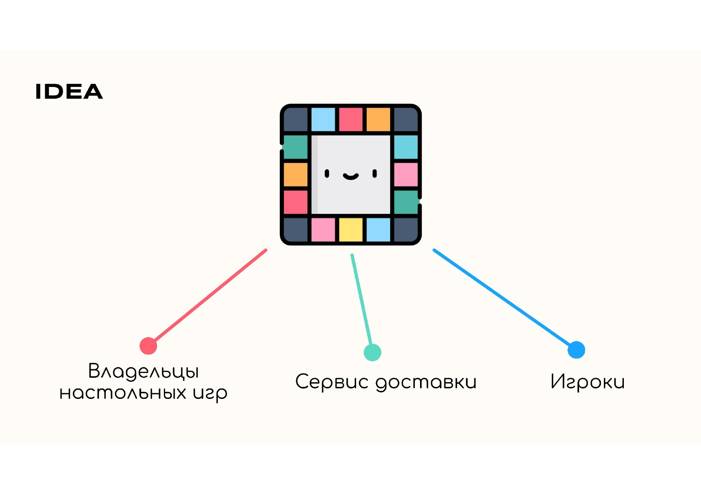
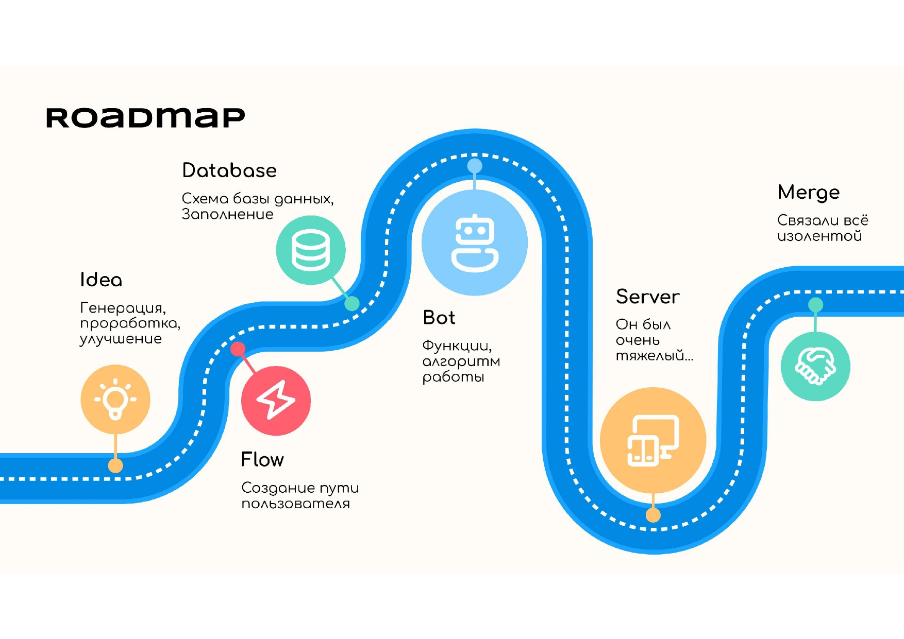
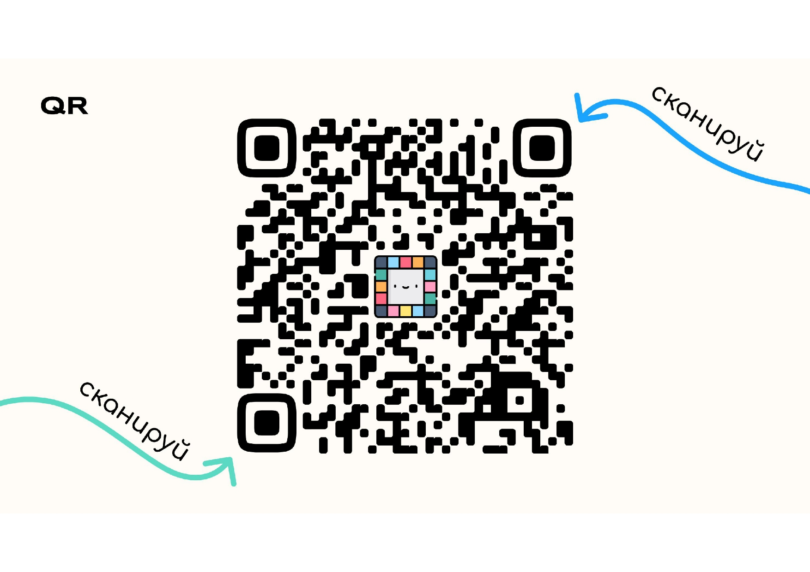
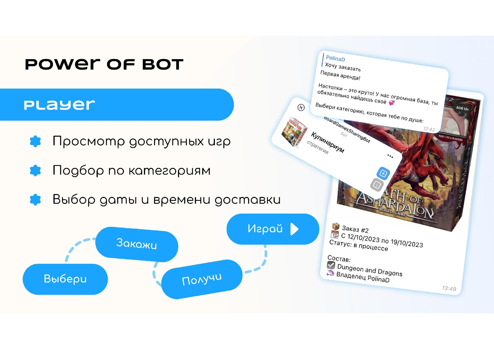
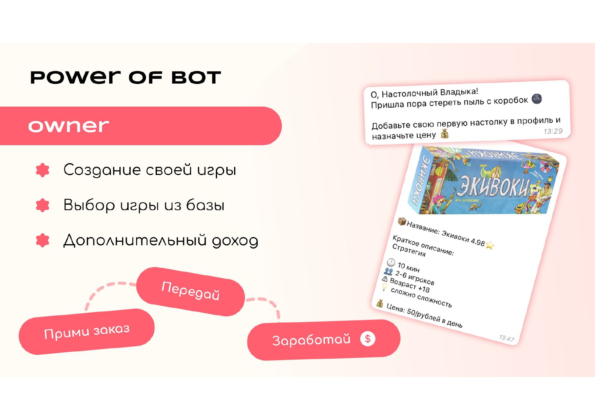
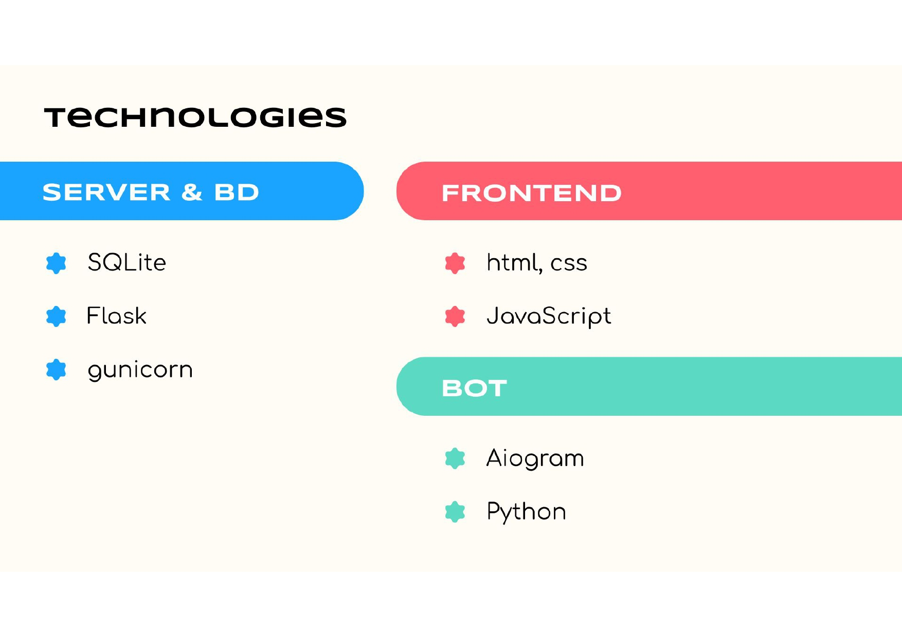
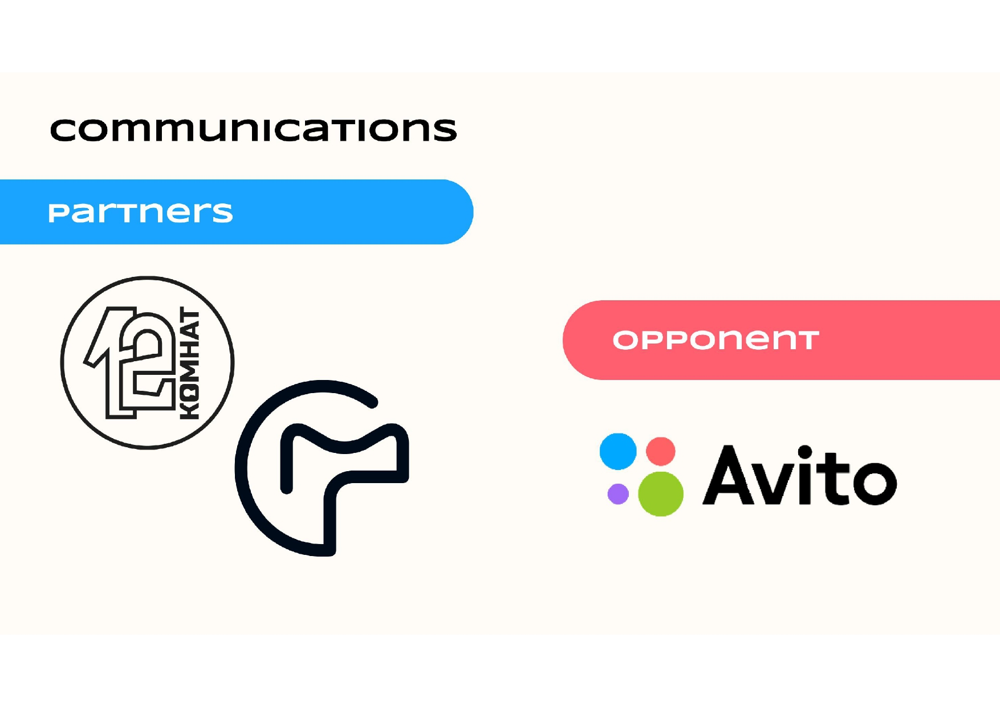
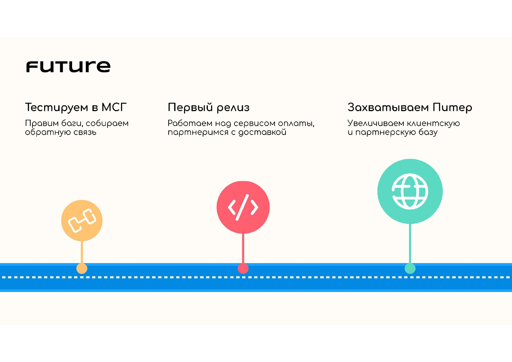

# Хакатон "Время IT"

В рамках данного хакатона была разработана серверная часть для бота в телеграмме,
который позволяет сдавать/брать настольные игры в аренду. По итогам хакатона мы с командой заняли 2 место.
---
[Диплом призера](other/II_Stepeni_S_amp_amp_kittens_Syvorotnev.pdf) \
[Полная презентация продукта](other/suaiHackPresentation.pdf)
---
### Технологический стек:
* Flask 3.0.0 
* Flask-cors 4.0.0 
* Gunicorn 21.0.1 
* Sqlite3
---

  

  

  

  

  

  

  

  

  

  

---